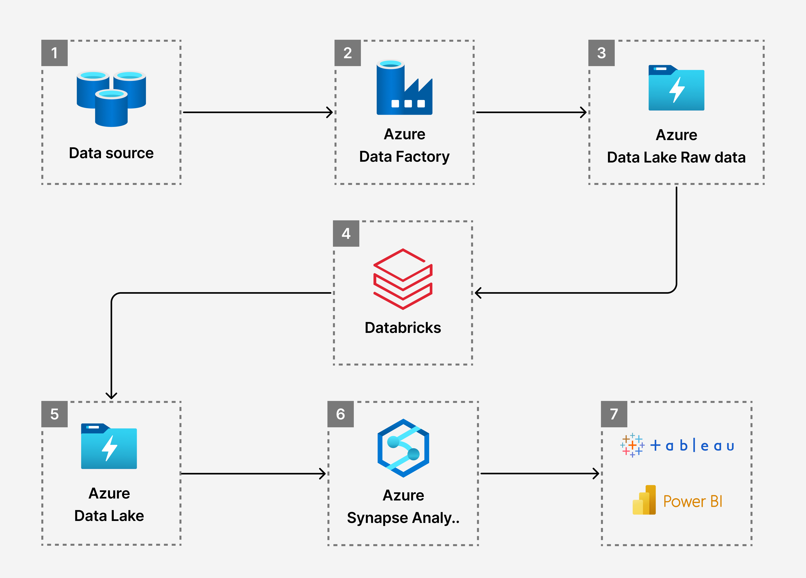
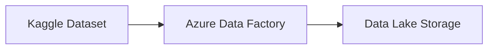
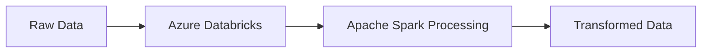
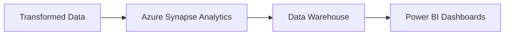

# 🏆 Olympics Data Engineering Project with Azure

[](https://azure.microsoft.com/)
[](https://spark.apache.org/)
[](https://powerbi.microsoft.com/)
[](https://www.python.org/)

> **End-to-End Data Engineering Pipeline**: From raw Olympics data ingestion to interactive dashboards using Azure cloud services

## 📋 Table of Contents

- [Overview](#overview)
- [Architecture](#architecture)
- [Dataset](#dataset)
- [Tech Stack](#tech-stack)
- [Project Workflow](#project-workflow)
- [Getting Started](#getting-started)
- [Data Pipeline](#data-pipeline)
- [Results & Analytics](#results--analytics)
- [Contributing](#contributing)
- [License](#license)

## 🎯 Overview

This project demonstrates a complete **Data Engineering pipeline** for the Tokyo 2021 Olympics dataset using Microsoft Azure services. The pipeline processes raw Olympics data through ingestion, transformation, storage, and analysis phases, culminating in interactive dashboards for data visualization.

### Key Features
- **Data Ingestion**: Automated data pipeline from Kaggle dataset
- **Data Transformation**: Apache Spark processing in Azure Databricks
- **Data Storage**: Scalable Azure Data Lake Storage Gen2
- **Data Analytics**: Azure Synapse Analytics for advanced analytics
- **Visualization**: Power BI dashboards for insights

## 🏗️ Architecture



### Architecture Components
1. **Data Source**: Kaggle Olympics Dataset
2. **Data Factory**: Orchestrates data movement and transformation
3. **Data Lake Storage**: Raw and processed data storage
4. **Databricks**: Apache Spark-based data processing
5. **Synapse Analytics**: Data warehouse and analytics
6. **Power BI**: Business intelligence and visualization

## 📊 Dataset

The project uses the **Tokyo 2021 Olympics Dataset** containing comprehensive information about:

| Dataset | Records | Description |
|---------|---------|-------------|
| `Athletes.csv` | 11,087 | Individual athlete information |
| `Teams.csv` | 745 | Team and country details |
| `Medals.csv` | 95 | Medal distribution data |
| `EntriesGender.csv` | 48 | Gender participation statistics |
| `Coaches.csv` | 396 | Coach and delegation information |

**Source**: [Kaggle - 2021 Olympics in Tokyo](https://www.kaggle.com/datasets/arjunprasadsarkhel/2021-olympics-in-tokyo/)

## 🛠️ Tech Stack

### Azure Services
- **Azure Data Factory** - Data orchestration and ETL pipelines
- **Azure Data Lake Storage Gen2** - Scalable data lake storage
- **Azure Databricks** - Apache Spark-based data processing
- **Azure Synapse Analytics** - Data warehouse and analytics
- **Power BI** - Business intelligence and visualization

### Technologies
- **Apache Spark** - Distributed data processing
- **Python** - Data transformation and analysis
- **SQL** - Data querying and analytics
- **Jupyter Notebooks** - Interactive data exploration

## 🔄 Project Workflow

### Phase 1: Data Ingestion


### Phase 2: Data Transformation


### Phase 3: Data Analytics


## 🚀 Getting Started

### Prerequisites
- Azure subscription
- Azure Data Factory instance
- Azure Databricks workspace
- Azure Synapse Analytics workspace
- Power BI Pro license

### Setup Instructions

1. **Clone the Repository**
   ```bash
   git clone https://github.com/yourusername/Data-Engineering-Project-using-Azure-on-Olympics-Dataset.git
   cd Data-Engineering-Project-using-Azure-on-Olympics-Dataset
   ```

2. **Download Dataset**
   - Visit [Kaggle Dataset](https://www.kaggle.com/datasets/arjunprasadsarkhel/2021-olympics-in-tokyo/)
   - Download and extract to `data_set/` directory

3. **Azure Setup**
   - Create Azure Data Factory instance
   - Configure Azure Data Lake Storage Gen2
   - Set up Azure Databricks workspace
   - Configure Azure Synapse Analytics

4. **Run Data Pipeline**
   - Execute Data Factory pipeline
   - Monitor transformation jobs in Databricks
   - Verify data in Synapse Analytics

## 📈 Data Pipeline

### 1. Data Ingestion
- **Source**: Kaggle Olympics Dataset
- **Tool**: Azure Data Factory
- **Destination**: Azure Data Lake Storage Gen2
- **Process**: Automated data ingestion with error handling

### 2. Data Transformation
- **Platform**: Azure Databricks
- **Engine**: Apache Spark
- **Operations**:
  - Data cleaning and validation
  - Schema standardization
  - Aggregation and enrichment
  - Quality checks and monitoring

### 3. Data Storage
- **Raw Zone**: Original dataset storage
- **Processed Zone**: Transformed and cleaned data
- **Curated Zone**: Business-ready datasets

### 4. Data Analytics
- **Platform**: Azure Synapse Analytics
- **Capabilities**:
  - SQL-based analytics
  - Machine learning integration
  - Real-time data processing
  - Advanced analytics queries

## 📊 Results & Analytics

### Key Insights
- **Medal Analysis**: Country-wise medal distribution
- **Athlete Performance**: Individual and team statistics
- **Gender Participation**: Olympic gender equality metrics
- **Geographic Trends**: Regional performance patterns

### Dashboard Features
- **Interactive Visualizations**: Real-time data exploration
- **Performance Metrics**: KPIs and analytics
- **Comparative Analysis**: Cross-country comparisons
- **Trend Analysis**: Historical and current patterns

## 🤝 Contributing

We welcome contributions! Please follow these steps:

1. **Fork the repository**
2. **Create a feature branch** (`git checkout -b feature/AmazingFeature`)
3. **Commit your changes** (`git commit -m 'Add some AmazingFeature'`)
4. **Push to the branch** (`git push origin feature/AmazingFeature`)
5. **Open a Pull Request**

### Contribution Guidelines
- Follow Azure best practices
- Include proper documentation
- Add unit tests for new features
- Ensure code quality and performance

## 📄 License

This project is licensed under the **MIT License** - see the [LICENSE](LICENSE) file for details.

## 📞 Contact

- **Project Link**: [https://github.com/yourusername/Data-Engineering-Project-using-Azure-on-Olympics-Dataset](https://github.com/yourusername/Data-Engineering-Project-using-Azure-on-Olympics-Dataset)
- **LinkedIn**: [Your LinkedIn Profile]
- **Email**: your.email@example.com

## 🙏 Acknowledgments

- **Kaggle** for providing the Olympics dataset
- **Microsoft Azure** for cloud infrastructure
- **Apache Spark** community for data processing capabilities
- **Power BI** team for visualization tools

---

⭐ **Star this repository if you find it helpful!**